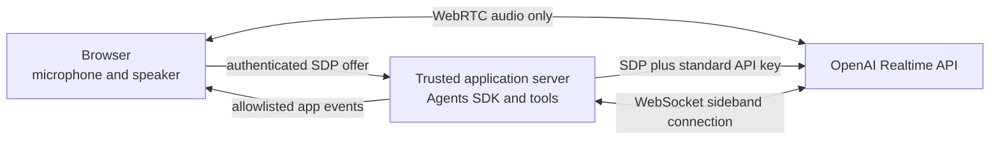

# Realtime voice agent with server-side controls

This example keeps the Realtime agent and server-side controls on a trusted Node.js application server while the browser uses WebRTC only for microphone and speaker audio.

The browser deliberately does not create an `RTCDataChannel`. It sends an audio-only SDP offer to the application server, which rejects any offer that does not contain exactly one active audio media section. The application server creates the Realtime call with a standard API key, keeps the returned call ID private, and attaches a server-side `RealtimeSession` through a WebSocket sideband connection. The SDP answer is returned only after the server receives the initial `session.updated` acknowledgement.



## How this maps to the Realtime API

This example combines three documented Realtime API building blocks:

1. The [unified interface](https://developers.openai.com/api/docs/guides/realtime-webrtc#creating-a-session-via-the-unified-interface) lets the application server combine the browser's SDP offer with server-owned session configuration and send both to `/v1/realtime/calls` using a standard API key. The browser therefore does not need an ephemeral token.
2. [WebRTC audio tracks](https://developers.openai.com/api/docs/guides/realtime-conversations#client-and-server-events-for-audio-in-webrtc) carry microphone input on a local audio track and deliver model audio through a remote media stream. The official browser example also creates an `oai-events` data channel for Realtime events; this example deliberately omits that step.
3. [Server-side controls](https://developers.openai.com/api/docs/guides/realtime-server-controls#with-webrtc) let the application server use the unique call ID from the response's `Location` header to establish a WebSocket sideband connection to the same Realtime session.

In this example, the Agents SDK manages server-side controls over that sideband connection after the application server passes the call ID as `callId` to `RealtimeSession.connect()`. Standard browser APIs manage the audio-only peer connection. The browser receives only a small allowlisted set of application events over Server-Sent Events (SSE); it never receives the Realtime event stream.

This is not the Agents SDK's standard browser WebRTC transport with a data-channel option disabled. The server-enforced SDP policy is the security boundary: removing a data channel only in browser code would not stop a modified client from adding one back to its SDP offer.

## Security boundary

- The browser receives no OpenAI API key, ephemeral token, `callId`, session instructions, tool definitions, transcripts, audio deltas, usage details, or raw provider errors.
- The browser cannot send Realtime client events such as `session.update`, `conversation.item.create`, or `response.create` because there is no data channel.
- The application server's SDP policy accepts only offers and answers with exactly one non-rejected `m=audio` media description (a nonzero port). It rejects any additional media description, including `m=application` (data channel) or `m=video`. Offers that violate this policy are rejected before calling OpenAI, and answers that violate this policy are rejected before returning them to the browser.
- The server binds every voice session to the current application principal, enforces one concurrent call per principal, and uses CSRF and exact-origin checks for mutating endpoints.
- Raw Realtime events pass through a deny-by-default projection that constructs a new public application event.
- Session close, initialization failure, sideband disconnect, expiry, and server shutdown all converge on idempotent cleanup that closes the SDK session and calls the Realtime hangup endpoint.

The included cookie session is only a runnable localhost authentication seam. It does not identify a real user and does not prevent an arbitrary local caller from creating its own demo principal. Before deploying this pattern, replace `DemoAuthStore` with your application's authentication and authorization, apply production rate limits, and derive `OpenAI-Safety-Identifier` from a stable privacy-preserving user identifier.

Audio-only transport does not prevent spoken prompt injection and does not make system instructions secret from model behavior. Server-side tools must authorize every privileged operation against `runContext.context`, not against tool arguments supplied by the model.

## Run the example

From the repository root:

```bash
cp examples/realtime-server-controlled/.env.example \
  examples/realtime-server-controlled/.env.local
```

Set `OPENAI_API_KEY` in `.env.local`, then run:

```bash
pnpm -F realtime-server-controlled dev
```

Open [http://127.0.0.1:5173](http://127.0.0.1:5173). Use this exact origin unless you also change `APP_ORIGIN`.

The Vite development server serves the browser and proxies `/api` to the application server on `127.0.0.1:3001`. WebRTC media flows directly between the browser and the OpenAI Realtime API; the application server is not an audio proxy.

## Verify without an API call

```bash
pnpm -F realtime-server-controlled test
pnpm -F realtime-server-controlled build-check
pnpm -F realtime-server-controlled build
```

The tests use fake browser and OpenAI boundaries. They do not need `OPENAI_API_KEY` and do not make live OpenAI requests.
